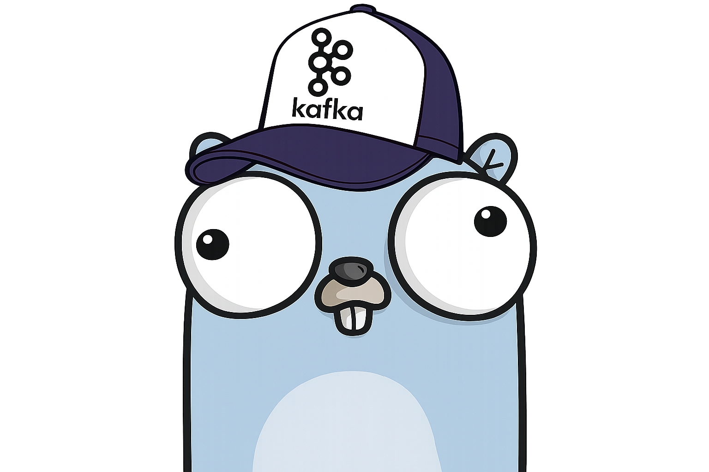

<h1>kafka-canary</h1>

<p>Small Kafka canary service in Go.</p>

<h2>What it does</h2>

- Produces probe messages to Kafka
- Reads them back to measure latency
- Exposes health and metrics for monitoring

<h2>Run</h2>

```bash
make run
