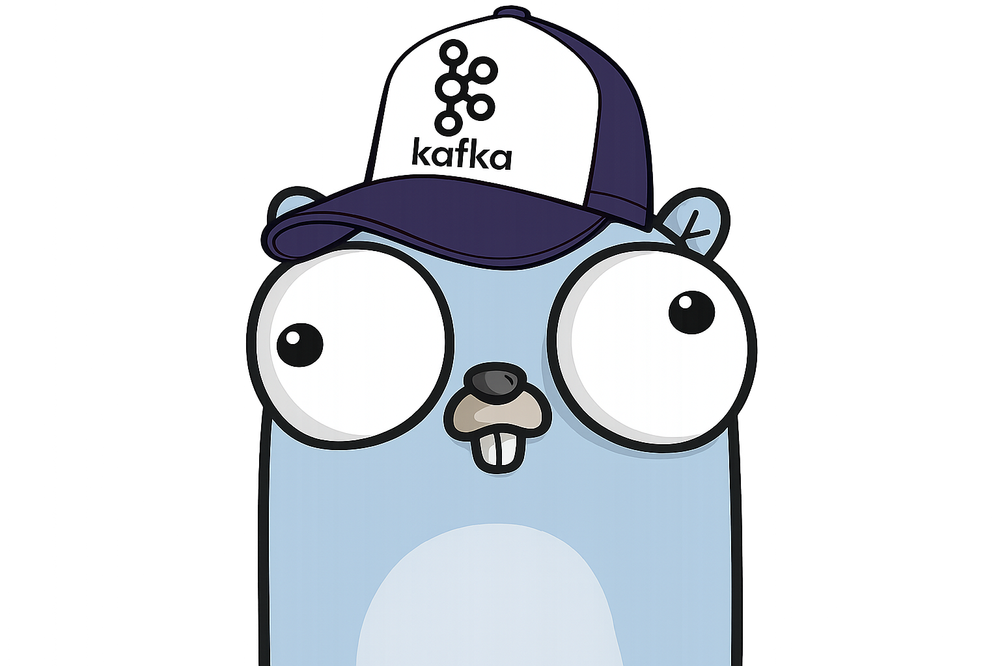
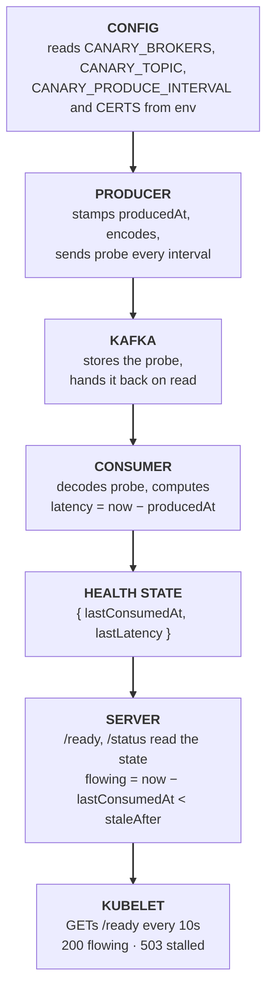

<h1>kafka-canary</h1>

<p>A small Go service that proves your Kafka cluster is actually
delivering messages, by sending a probe, reading it back, and reporting
the result over HTTP.</p>

Existing Kafka monitors tell you the broker process is running. None of them
tell you a message can still get in one end and out the other. This one does,
and it flips a health endpoint red the moment that stops.

## What it is

A heartbeat, not a metrics system. It runs a loop:

```text
produce ──> send a probe message to a topic every few seconds
consume ──> read it back, measure the round-trip latency
expose  ──> /ready returns 200 while messages flow, 503 when they stop
```

That is the whole thing. Point it at any Kafka, run it on Kubernetes, and let
the kubelet readiness probe hit `/ready`. When Kafka stops delivering, the pod
goes NotReady and you know. Kafka errors are logged, never fatal: the service
stays up during an outage and reconnects on its own.

## Why it's different

* **Heartbeat, not up/down.** Measures the real produce to consume round trip,
  so it catches a cluster that is alive but silently not delivering.
* **Per-partition health.** One stuck partition trips the alarm. Blob-level
  monitors miss that.
* **Kuma-first, dependency-free.** `/status` returns 503 when dead. No
  Prometheus, no Strimzi, no Kubernetes required.
* **Drop-in for any Kafka.** Change `CANARY_BROKERS` plus auth env and run. Not
  tied to a platform.

Modeled on [strimzi-canary](https://github.com/strimzi/strimzi-canary), which
is now archived. The code favors being readable over being clever.

## Quick start

```bash
docker compose up --build
```

Kafka and the canary come up together. Then:

```bash
curl localhost:8080/status
# {"messagesFlowing":true,"lastLatencyMs":7,"lastConsumedAgo":"3.4s"}
```

Against your own Kafka, set `CANARY_BROKERS` and run the image directly:

```bash
docker run -e CANARY_BROKERS=your-broker:9092 -p 8080:8080 ghcr.io/neomat-prog/kafka-canary
```

## Endpoints

| Path | Returns |
|---|---|
| `/healthy` | `200` while the process is alive (liveness) |
| `/ready` | `200` if messages are flowing, `503` if stalled (readiness) |
| `/status` | JSON: `{"messagesFlowing":true,"lastLatencyMs":7,"lastConsumedAgo":"3.4s"}` |

Point an Uptime Kuma HTTP monitor at `/status` (accept status 200, or keyword
match `"messagesFlowing":true`). Kuma going red means the cluster stopped
delivering.

## Configuration (env)

| Var | Default | Meaning |
|---|---|---|
| `CANARY_BROKERS` | `localhost:9092` | bootstrap broker list (CSV) |
| `CANARY_TOPIC` | `__strimzi_canary` | probe topic |
| `CANARY_CONSUMER_GROUP` | `canary-group` | consumer group id |
| `CANARY_PRODUCE_INTERVAL` | `5s` | how often to send a probe |
| `CANARY_METRICS_ADDR` | `:8080` | HTTP listen address |

mTLS is supported for secured clusters via `CANARY_CA_CERT` /
`CANARY_CLIENT_CERT` (Strimzi PKCS12 keystores). Empty means plaintext.

## How it works


```mermaid
flowchart TD
    config["<b>CONFIG</b><br/>reads CANARY_BROKERS, CANARY_TOPIC,<br/>CANARY_PRODUCE_INTERVAL and CERTS from env"]
    producer["<b>PRODUCER</b><br/>stamps producedAt, encodes,<br/>sends probe every interval"]
    kafka["<b>KAFKA</b><br/>stores the probe,<br/>hands it back on read"]
    consumer["<b>CONSUMER</b><br/>decodes probe, computes<br/>latency = now − producedAt"]
    state["<b>HEALTH STATE</b><br/>{ lastConsumedAt, lastLatency }"]
    server["<b>SERVER</b><br/>/ready, /status read the state<br/>flowing = now − lastConsumedAt &lt; staleAfter"]
    kubelet["<b>KUBELET</b><br/>GETs /ready every 10s<br/>200 flowing · 503 stalled"]

    config --> producer --> kafka --> consumer --> state --> server --> kubelet

    linkStyle default stroke-width:2px
```

## Why it was built

Built with a DevOps team that needed to verify Kafka health during outages. The
officially supported Strimzi Canary had been archived and no maintained
alternative existed, so this fills that gap: a single Go binary, driven entirely
by env, that works against any Kafka.

## Run

```bash
go run ./cmd/canary                # local, against $CANARY_BROKERS
docker compose up --build          # Kafka + canary together
kubectl apply -f k8s/canary.yaml   # on Kubernetes (set CANARY_BROKERS first)
```

## License

[MIT](LICENSE)
